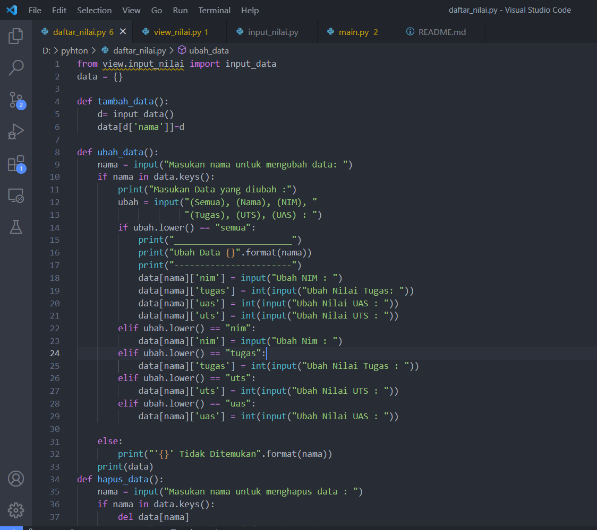
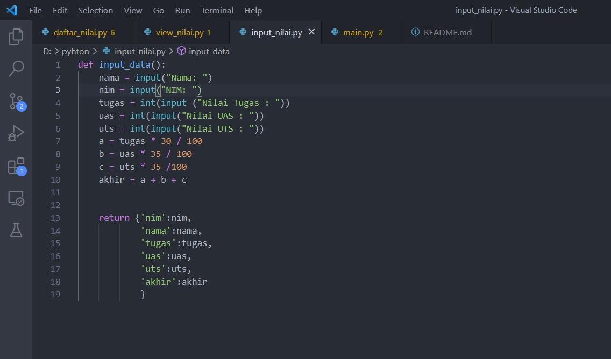
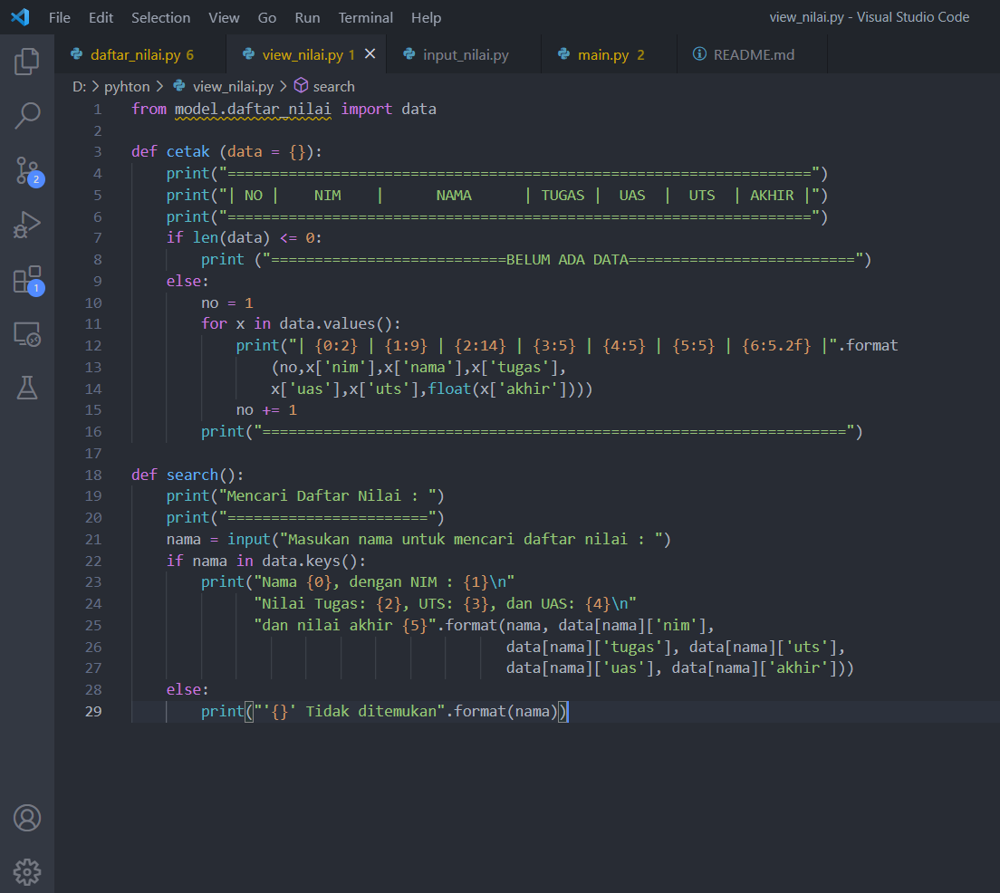
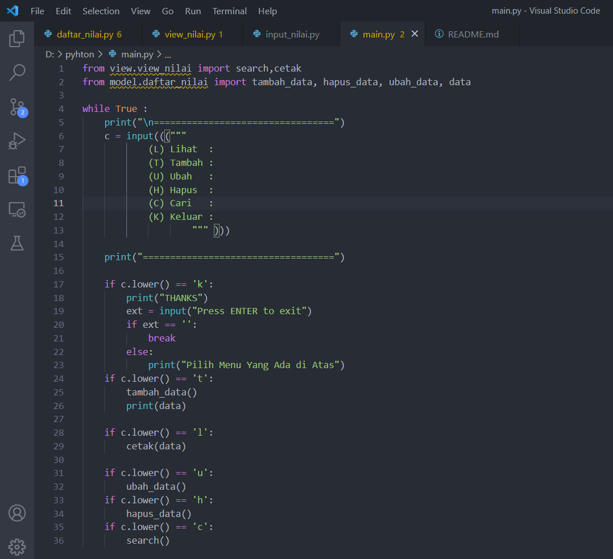

# UAS_RioSaputra_312110533

## Penjelasan Program
### daftar_nilai.py
berisi modul untuk tambah_data, ubah_data, hapus_data, dan cari_data

### view_nilai.py 
berisi modul untuk cetak_daftar_nilai, cetak_hasil_pencarian

### input_nilai.py 
berisi modul untuk:
input_data yang meminta pengguna
memasukkan data.

### main.py 
berisi program utama 
(menupilihan yang memanggil semua menu yang ada)

